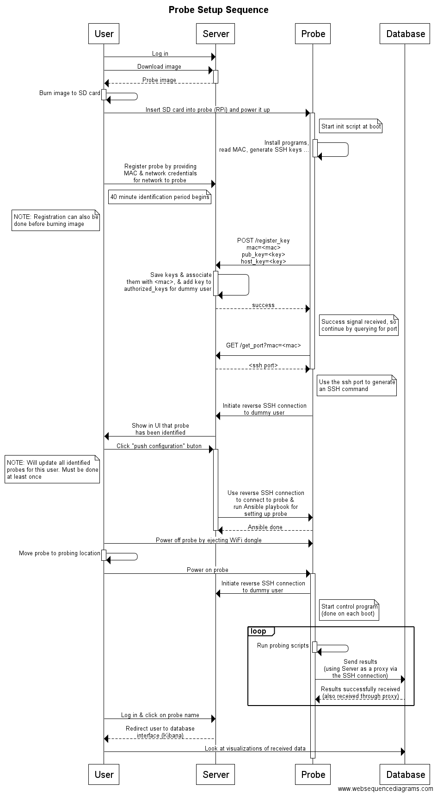

# WiFi probe documentation

**Links**:

* [Website project repository](https://github.com/UNINETT/probe-website)
* [Ansible probe repository](https://github.com/UNINETT/ansible-probes)

This doc explains how the WiFi probing system works. The following sequence
diagram counts as an overview of the system, while more in-depth information
can be found in the rest of the document.

